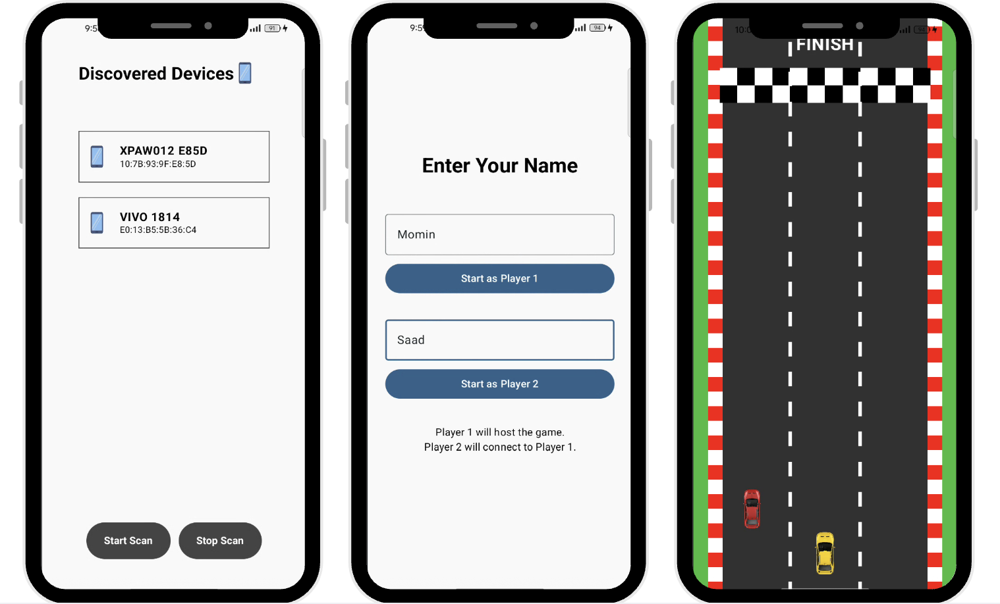

# Bluetooth Racing Game 🚗🎲

A real-time **multiplayer racing game** built with **Jetpack Compose** and **Bluetooth connectivity**. Players connect devices, roll dice (with **voice commands** 🚀), and race animated cars on a custom track — first to the finish line wins!  

This project is part learning, part fun, and a deep dive into **Bluetooth communication on Android**.  

---

## ✨ Features
- 📡 **Bluetooth pairing & connection** with nearby devices  
- 🎮 **Multiplayer racing** with turn-based dice rolls  
- 🎲 **Voice-controlled dice rolling** (no buttons needed!)  
- 🏎️ Animated **car movement on a custom race track**  
- 🔄 **Turn syncing** across devices in real-time  
- 🏁 Victory goes to the first car crossing the finish line  

---

## 🛠 Tech Stack
- [Jetpack Compose](https://developer.android.com/jetpack/compose) – Modern, declarative UI  
- **MVI Architecture** – Predictable & scalable state management  
- [Koin](https://insert-koin.io/) – Dependency Injection  
- [Jetpack Navigation](https://developer.android.com/guide/navigation)  
- [Kotlin Serialization](https://github.com/Kotlin/kotlinx.serialization) – Data serialization  
- **Bluetooth APIs** – Device discovery, pairing, and data communication  
- **Voice Recognition API** – For voice-based dice rolls  

---

## 🏗 Architecture
This project follows **MVI (Model-View-Intent)** with a **clean separation of concerns**:  
- **UI Layer** → Jetpack Compose screens  
- **ViewModel Layer** → State management & event handling  
- **Data Layer** → Bluetooth communication, serialization, and repository  

Unidirectional data flow makes the game **predictable and easy to debug**.  

---

## 🚧 Challenges
- Some devices had “trust issues” 😅 and refused to connect  
- Syncing turn logic across devices via Bluetooth messages  
- Deciding the **next player’s turn** fairly  
- Handling **real-time communication** without lag  

---

## 📚 Learnings
- 🔑 How Bluetooth pairing & socket communication really work  
- 🌀 Lifecycle of a multiplayer game  
- 🎤 Voice input integration into game logic  
- ✨ How to make Bluetooth apps actually fun  

---

## 🔮 Future Updates
- 🎛️ Haptic feedback for dice rolls  
- ⛔ Obstacle animations & boosters on the track  
- 🏆 Scoreboard at game results  
- 🤖 Single-player mode with AI opponent  
- 📱 Publish on Play Store (maybe 😉)  

---

## 📸 Demo
<p align="center">
  
</p>

---

## 📖 References
- [Android Bluetooth official docs](https://developer.android.com/develop/connectivity/bluetooth)  
- [Android Bluetooth API — Medium Guide](https://medium.com/@elementalistbtg/android-bluetooth-api-all-you-need-to-know-d9225a84754)  
- [Project GitHub Repo](https://github.com/momintahir/BluetoothRacerApp)  

---

## 📝 License
```
Copyright 2025 Momin Tahir

Licensed under the Apache License, Version 2.0 (the "License");
you may not use this project except in compliance with the License.
```

---

🔥 Crafted with passion by **Momin Tahir**
